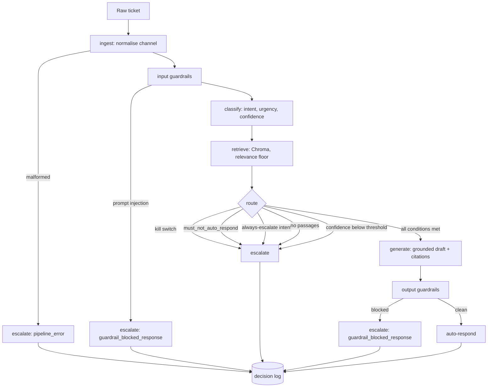

# Architecture

## The problem this shape is built for

The discovery evidence is unambiguous: 71.4% of tickets are answerable from the
existing documentation, and 38.7% of those were escalated anyway. Removing the
overlapping set — tickets already flagged as requiring a human — leaves **107 of 500
tickets (21.4%) that were escalated despite being answerable**, consuming roughly
1,292 handling hours at a median of 734 minutes each.

That number is the target. The system is not designed to hold conversations; it is
designed to route those 107 tickets to an answer, and to escalate everything else
quickly with enough context that the human does not restart the triage.

Two further findings shaped the design:

- **Answerable tickets resolve in a median 48 minutes; non-answerable in 750.** The
  cost of wrongly escalating an answerable ticket is small; the cost of wrongly
  answering a non-answerable one is a customer given a confident wrong answer. The
  routing rules are asymmetric in favour of escalation for that reason.
- **Non-fluent speakers score CSAT 1.95 against 2.80 for fluent speakers, with first
  contact resolution of 21% against 54%.** Fluency is therefore never an input to
  classification, and every metric is reported sliced by fluency.

## Flow

Implemented as a LangGraph `StateGraph` in [../src/pipeline.py](../src/pipeline.py).
Every node is individually wrapped: a node that raises records a degradation reason
and the ticket escalates. `Pipeline.process` is documented and tested as never raising,
because the harness must survive ticket 40 of 120 failing.

## Component notes

### Ingestion

Channel-specific parsing is confined to this module. Email quoted history, reply
headers and signatures are stripped; chat speaker turns are removed; forum `[quote]`
blocks and `Re:` prefixes are dropped; docs-comment page anchors are removed. All four
produce the same `NormalisedTicket`.

**155 of 500 development tickets have an empty subject, and all 155 are chat.** The
subject is synthesised from the first sentence of the body and flagged
`subject_was_synthesised`, so no downstream component has to handle the empty case.

### Classification

22 intents and 3 urgency levels, from a versioned prompt with an explicit confidence
rubric. Two things matter here:

- The intent list is injected into the prompt and the response is coerced against it.
  An unrecognised intent falls back to the keyword classifier rather than propagating.
- A deterministic keyword classifier backs the model call. Its confidence is capped at
  0.55, below the 0.80 routing threshold, so a provider outage degrades to *escalate
  everything* rather than to *answer everything badly*.

### Retrieval

Chroma with all-MiniLM-L6-v2, cosine distance, 400-character chunks with 60 overlap,
top 5, relevance floor 0.55. Each chunk is prefixed with its document title so short
chunks stay self-describing, and the chunk id is `DOC-ID#NNN` so a citation can be
traced to the exact passage. See [retrieval_experiment.md](retrieval_experiment.md).

The retriever returning nothing is a supported outcome, not a failure.

### Routing

A pure function of already-computed facts: no model call, no I/O, no randomness. It is
the decision a human will be asked to defend, so it must be reproducible from the log
alone. Tested for determinism over repeated invocation.

The always-escalate list is `security_incident`, `compliance_request`,
`feature_request`, `unclear_request`. The first two carry legal exposure. The last two
have 0% documentation coverage in the corpus, so no amount of retrieval will help.

### Generation and citations

The prompt supplies only the retrieved passages and forbids outside knowledge. Every
citation is then checked against the passages actually retrieved *for that ticket*, and
any that does not resolve is stripped from the text and recorded. A citation that does
not resolve is worse than no citation, because it manufactures confidence.

`INSUFFICIENT_CONTEXT` is an explicit escape hatch: the model can decline, and that
declination routes to a human.

### Guardrails

Input phase — prompt injection (blocks), inbound PII (recorded, does not block; it is
the customer's own data, and the enforcement point is the output side).

Output phase, any of which blocks the reply and forces escalation:

| Guardrail | Blocks when |
|---|---|
| `pii_leak` | Email, card, API key, token, password, national ID or IP address appears in the reply |
| `forbidden_claim` | Reply claims a refund was issued, the issue is fixed on our side, a fix date, or compensation |
| `citation_resolves` | A citation does not correspond to a retrieved passage |
| `grounding_required` | The reply makes claims with no citation at all |
| `substantive_reply` | The reply is too short to be useful |

The forbidden claims are taken directly from the `must_not_claim` field present on
every reference response in `ground_truth_responses.json`.

**There is no naturally occurring PII in the 500 development tickets.** The PII
guardrail is therefore proven against engineered fixtures in
[../tests/fixtures/tickets.json](../tests/fixtures/tickets.json). A guardrail that has
never fired has never been tested.

### Decision log

SQLite, with the schema prescribed in the Setup Guide. Three rows per ticket —
`classify`, `retrieve`, `final` — and the `final` row is written on every path,
including pipeline failure. Reconciliation compares the set of ticket ids with a
`final` row against the set processed; the metrics report fails the governance
condition if they differ by one.

## Traceability

| Requirement | Evidence | Implementation | Test |
|---|---|---|---|
| REQ-F01 normalise four channels | 155 empty subjects, all chat | `src/ingest.py` | `test_ingest.py` |
| REQ-F02 intent, urgency, confidence | 22 intents in the label set | `src/classify.py` | `test_pipeline.py::TestClassification` |
| REQ-F03 retrieve from the corpus | 71.4% answerable from docs | `src/retrieve.py` | `test_retrieval.py::TestRetrieval` |
| REQ-F04 deterministic routing | 38.7% of answerable escalated | `src/route.py` | `test_route.py` |
| REQ-F05 grounded drafting | 29-article corpus, 31,733 characters | `src/generate.py` | `test_retrieval.py::TestCitations` |
| REQ-F06 citations resolve | `expected_doc_ids` on every labelled ticket | `src/generate.py::validate_citations` | `test_retrieval.py::TestCitations` |
| REQ-F07 guardrails block | `must_not_claim` on every reference response | `src/guardrails.py` | `test_guardrails.py` |
| REQ-G01 decision logging | Governance Framework minimum schema | `src/logging_store.py` | `test_pipeline.py::test_every_ticket_produces_exactly_one_final_decision` |
| REQ-N03 graceful degradation | Single-provider risk | `src/llm.py`, `src/pipeline.py` | `test_pipeline.py::TestEndToEnd` |
| REQ-N04 service interface | — | `src/api.py` | — |
| REQ-E01 unattended batch run | Hidden set of 120 unseen tickets | `evaluation/harness.py` | `test_harness.py::TestHarnessContract` |
| REQ-E02 three-tier metrics | Evaluation Framework | `evaluation/metrics.py` | `test_harness.py::TestMetrics` |

## Known limitations

- The satisfaction figure is a rubric proxy scored automatically, not customer
  feedback. It measures rubric compliance and nothing more.
- The hallucination rate produced by the harness is an automated lower bound covering
  uncited claims, unresolvable citations and forbidden claims. The Evaluation
  Framework's requirement — 50 responses, two independent assessors, reported agreement
  — is a manual exercise whose result belongs in the report, not in this code.
- The sample spans 89 days at roughly 39 tickets a week, not the 500 a week the client
  reports. It is a quarterly extract, so the intent mix may not match live traffic.
- All 29 documents have `last_reviewed_days_ago = 0`, so documentation staleness cannot
  be tested against this data. The risk is real but unmeasurable here.
